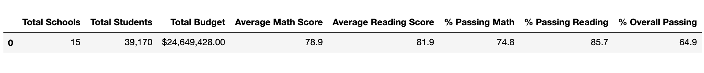
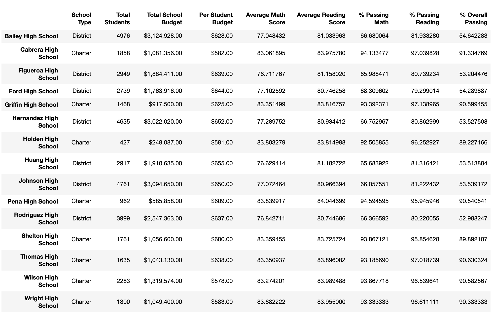
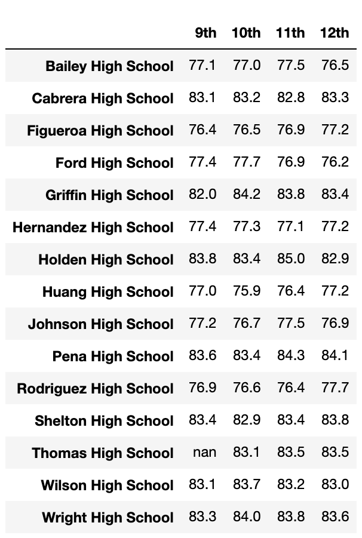
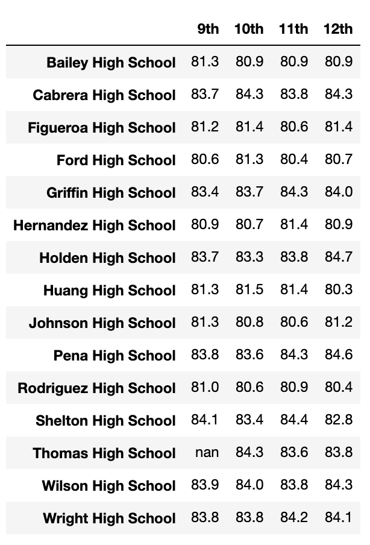
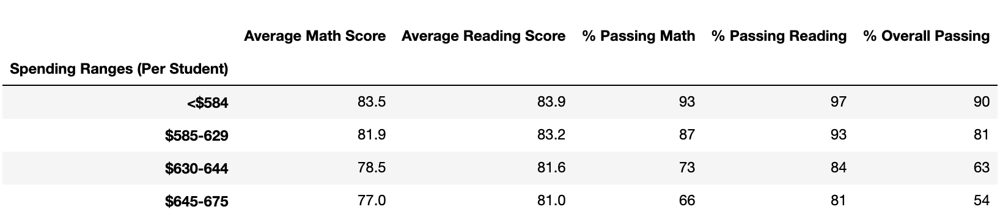
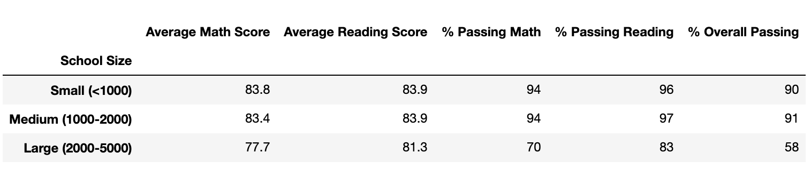
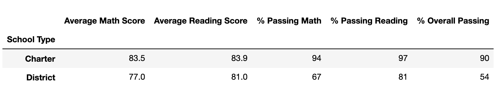

# School District Analysis
Module 4

## Overview of Project

This analysis has been conducted to support the Chief Data Scientist for the School District in presenting important, focused information to the Superintendent and the School Board so that the upmost, forward thinking decisions can be made for the District's upcoming year's schools' budget and top priorities. Data sets were provided offering a detailed look into performance trends and patterns based on the student populations' standardized test scores for math and reading along with a variety of information about the schools they attend (i.e.: student funding, size, type, and budget). The completed task here shows diligent, aggregated data to provide a variety of snapshots into the results.

## Results

<B><li> District Summary </li></B>

The District Summary provides a snapshot (below) to reflect the amount of schools located within the District, how many students attend these schools, the total budget; along with the average standardized test scores and the passing percentage based on the student population. Each student's test data and school's profile information were combined to create one unified source of data, this data was cleaned and organized to ensure that the merging of data would not cause errors in the analysis. Each student and school's contribution to the data set affect the overall outcomes as any incomplete or incorrect data would not produce accurate results. 

<B><li>School Summary</li></B>

The School Summary allows an overview of each school within the District. Each school is provided as an index and is accompanied by a variety of attributes to include the type, total student count, the school's budget, the school's per student budget, the average score of the standardized tests, and the school's percentage of those test that were of a passing grade (a 70% or higher). The attributes allow you to compare how one school attribute can affect the test scores of the students. 

<B><li>Replacing the 9th Graders at Thomas High School and its effect on THS's performance relative to other schools</li></B>

As reflected in the above School Summary snapshot - Thomas High School produced some of the lowest percentages of passing scores in the standardized test results. When removing the test scores of THS's 9th graders; therefore, revising the THS data to reflect 10th - 12th graders only allowed for THS to move from the lower performing schools to the 2nd highest performing school. 

<table>
<tr>
<th><B>Score Type</B></th>
<th><B>THS 9th - 12th Graders</B></th>
<th><B>THS 10th - 12th Graders</B></th>
</tr>
<tr>
<th><B>Math</B></th>
<th>66.9%</th>
<th>93.2%</th>
</tr>
<tr>
<th><B>Reading</B></th>
<th>69.6%</th>
<th>97.0%</th>
</tr>
<tr>
<th><B>Math & Reading</B></th>
<th>65.1%</th>
<th>90.6%</th>
</tr>
</table>

<B><li>Additional effects of the revised Thomas High School's student population</li></B>

<ul>1. Math and Reading Scores by Grade</ul>
<i><B>Math Scores by Grade</B></I>

<i><B>Reading Scores by Grade</B></I>

The 9th graders' math and reading scores were replaced with NaN which means that there is no result that can be produced or measured therefore returning a NaN value. 
 
 
<ul>2. Scores by School Spending</ul>

The NaN value is not being calculated in the below values so are not reflected in the below snapshot of the test scores. The affect is only seen by the increase in test scores derived from the lower performing scores being removed (in reference to THS, in the spending range of )$630-$644,THS spends $638 per student). 
 
 
<ul>3. Scores by School Size</ul>

The NaN value is not being calculated in the below values so are not reflected in the below snapshot of the test scores. The affect is only seen by the increase in test scores derived from the lower performing scores being removed (in reference to THS, in the school size of Medium (1000-2000), THS has a total student count of 1635). 
 
 
<ul>4. Scores by School Type</ul>

The NaN value is not being calculated in the below values so are not reflected in the below snapshot of the test scores. The affect is only seen by the increase test scores derived from the lower performing scores being removed (in reference to THS, in the school type Charter). 

## Summary
The analysis provided a variety of descriptors that could lead to constructive planning in increasing the overall performance of the students within the School District.
<li>The top 5 performing schools are all Charter School Types; whereas, the lowest 5 performing schools are all District School Types. This is also strongly seen in the Scores by School Type as the overall passing percentage (students who passed both math and reading) is 90% at the Charter Schools and 54% at the District Schools </li>
<li>There is minimal variances across the grade levels in both math and reading as well as minimal variance across the school population</li>
<li>The schools in the lowest Spending Range produced the highest performance scores.</li>
<li>The schools with the Small and Medium School Size (student population) had little variance between them but out performed the Large School Size</li>

